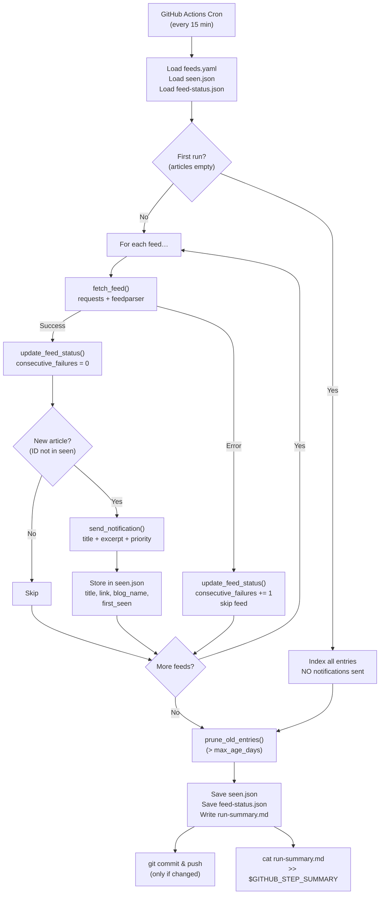

# Hermes — Technical Documentation

> **Hermes** 🕊️ — A zero-infrastructure RSS/Atom/JSON feed monitor that sends push notifications via [ntfy.sh](https://ntfy.sh), powered entirely by GitHub Actions cron.

---

## Table of Contents

1. [System Overview](#system-overview)
2. [Repository Structure](#repository-structure)
3. [Architecture](#architecture)
4. [Data Flow](#data-flow)
5. [Component Deep-Dive](#component-deep-dive)
   - [feeds.yaml — Configuration](#1-feedsyaml--configuration)
   - [seen.json — Article State](#2-seenjson--article-state)
   - [feed-status.json — Feed Health](#3-feed-statusjson--feed-health)
   - [hermes.py — Core Script](#4-hermespy--core-script)
   - [check-feeds.yml — GitHub Actions Workflow](#5-check-feedsyml--github-actions-workflow)
   - [Test Suite](#6-test-suite)
6. [Notification Format](#notification-format)
7. [Error Handling](#error-handling)
8. [Future Roadmap](#future-roadmap)

---

## System Overview

Hermes solves a simple problem: **"I follow many blogs but forget to check them."** It continuously polls RSS/Atom/JSON feeds on a 15-minute cron schedule, detects new posts, and pushes notifications straight to your phone — no server, no database, no cost.

### Key Design Properties

| Property | Implementation |
|---|---|
| **Language** | Python 3.12 (single `hermes.py` file, ~450 lines) |
| **Feed Parsing** | `feedparser` — handles RSS 2.0, Atom 1.0, JSON Feed |
| **Notifications** | [ntfy.sh](https://ntfy.sh) — free, open-source HTTP push |
| **Scheduling** | GitHub Actions `cron` — every 15 minutes |
| **State Persistence** | `seen.json` + `feed-status.json` committed to repo via bot |
| **Configuration** | `feeds.yaml` — human-edited, YAML format |
| **Infrastructure Cost** | \$0 (public repo) / ~720 min/month Actions (private repo, well within free tier) |

---

## Repository Structure

```
hermes/
├── .github/
│   └── workflows/
│       └── check-feeds.yml     # GitHub Actions cron workflow
├── tests/
│   └── test_hermes.py          # 28-test unit suite
├── hermes.py                   # Core Python script
├── feeds.yaml                  # User-configured feed list (edit this)
├── seen.json                   # Article dedup state (auto-managed by bot)
├── feed-status.json            # Per-feed health metrics (auto-managed by bot)
├── requirements.txt            # Python dependencies
├── pytest.ini                  # Test configuration
├── TECHNICAL.md                # This file
└── .gitignore
```

> [!NOTE]
> `run-summary.md` is generated fresh on every run and piped to the GitHub Actions Job Summary tab. It is **not** committed to the repo (gitignored).

---

## Architecture

```
┌──────────────────────────────────────────────────────────────────────┐
│                    GitHub Actions (*/15 cron)                        │
│                                                                      │
│  ┌──────────┐  ┌──────────┐  ┌────────────┐  ┌────────────────────┐ │
│  │ Checkout  │─►│   pip    │─►│  hermes.py │─►│ Publish            │ │
│  │  repo     │  │ install  │  │            │  │ $GITHUB_STEP_SUMMARY│ │
│  └──────────┘  └──────────┘  └─────┬──────┘  └────────────────────┘ │
│                                     │                                │
│                              ┌──────▼──────┐                        │
│                              │  git commit  │                        │
│                              │  seen.json   │                        │
│                              │  feed-status │                        │
│                              └─────────────┘                        │
└──────────────────────────────────────────────────────────────────────┘
           │                        │                    │
           ▼                        ▼                    ▼
  ┌──────────────┐         ┌──────────────┐    ┌──────────────────┐
  │  26 RSS/Atom │         │   ntfy.sh    │    │  Actions Summary  │
  │   feeds      │         │  ──► Phone📱 │    │  (markdown table) │
  └──────────────┘         └──────────────┘    └──────────────────┘
```

### Concurrency Safety

The workflow uses `concurrency: { group: hermes, cancel-in-progress: false }` — overlapping cron runs are **queued, not cancelled**, preventing race conditions on `seen.json` and `feed-status.json` commits.

---

## Data Flow



---

## Component Deep-Dive

### 1. feeds.yaml — Configuration

The only file you manually edit. Defines your ntfy topic and the list of feeds to monitor.

```yaml
ntfy_topic: "hermes_blog_notification"  # Required — subscribe to this in the ntfy app
ntfy_server: "https://ntfy.sh"          # Optional — default ntfy.sh (for self-hosted)
max_age_days: 30                        # Optional — state retention window (default 30)

feeds:
  # Per-feed fields:
  #   name     (required) Label shown as notification title
  #   url      (required) RSS, Atom, or JSON Feed URL
  #   priority (optional) ntfy priority: urgent | high | default | low | min

  - name: "Julia Evans (Linux/OS)"
    url: "https://jvns.ca/atom.xml"
    priority: "high"         # Must-read — alert immediately

  - name: "Simon Willison (AI/Web/SQLite)"
    url: "https://simonwillison.net/atom/everything/"
    priority: "low"          # Very prolific — deliver silently

  - name: "Robin Wieruch (React/TS)"
    url: "https://www.robinwieruch.de/index.xml"
    # priority omitted → "default"
```

**Top-level fields:**

| Field | Required | Default | Description |
|---|---|---|---|
| `ntfy_topic` | ✅ | — | ntfy topic string; subscribe to this in the ntfy app |
| `ntfy_server` | ❌ | `https://ntfy.sh` | Base URL, override for self-hosted instances |
| `max_age_days` | ❌ | `30` | Articles older than this are pruned from `seen.json` |

**Per-feed fields:**

| Field | Required | Default | Description |
|---|---|---|---|
| `name` | ✅ | — | Human-readable name; shown as the ntfy notification title |
| `url` | ✅ | — | RSS 2.0, Atom 1.0, or JSON Feed URL |
| `priority` | ❌ | `"default"` | ntfy priority level; invalid values silently fall back to `"default"` |

**ntfy priority levels** (from [ntfy docs](https://docs.ntfy.sh/publish/#message-priority)):

| Value | Phone Behaviour |
|---|---|
| `urgent` | Always rings, even if Do Not Disturb is on |
| `high` | Sound + vibration |
| `default` | Normal notification |
| `low` | Silent — appears in tray, no sound |
| `min` | No notification, only visible in app history |

---

### 2. seen.json — Article State

Tracks which articles have already triggered a notification. Committed to the repo automatically by `hermes-bot` after every run that detects changes.

**Schema:**

```json
{
  "articles": {
    "https://jvns.ca/blog/2024/how-dns-works/": {
      "first_seen": 1789328908,
      "title": "How DNS Works",
      "link": "https://jvns.ca/blog/2024/how-dns-works/",
      "blog_name": "Julia Evans (Linux/OS)"
    }
  }
}
```

| Field | Type | Purpose |
|---|---|---|
| `first_seen` | Unix timestamp | Used for pruning — entries older than `max_age_days` are evicted |
| `title` | string | Cached article title (used in run summary without re-fetching) |
| `link` | string | Permalink — used as the `Click` action in ntfy notifications |
| `blog_name` | string | Source feed name — used in run summary and feed health reporting |

**Pruning:** On every run, entries older than `max_age_days` (default 30) are evicted. This keeps the file bounded regardless of how long Hermes runs.

**First-run safety:** If `articles` is empty, Hermes indexes all current feed entries as "already seen" **without sending any notifications**. This prevents a flood of old articles on initial setup.

**Migration:** `load_seen()` automatically migrates legacy formats:
- Plain Unix timestamps (v1 format) → full metadata dict
- Entries with `sent_count` (throwback era) → `sent_count` is silently dropped

---

### 3. feed-status.json — Feed Health

Tracks per-feed health metrics across runs. Committed alongside `seen.json` by `hermes-bot`. Intended as the data source for a future web dashboard.

**Schema:**

```json
{
  "last_updated": "2026-10-03T09:00:00Z",
  "feeds": {
    "Julia Evans (Linux/OS)": {
      "url": "https://jvns.ca/atom.xml",
      "article_count": 42,
      "last_success": "2026-10-03T09:00:00Z",
      "last_error": null,
      "consecutive_failures": 0
    },
    "Use The Index, Luke (DB Indexing)": {
      "url": "https://use-the-index-luke.com/blog/feed",
      "article_count": 5,
      "last_success": "2026-09-15T08:00:00Z",
      "last_error": "HTTPError: 503 Service Unavailable",
      "consecutive_failures": 12
    }
  }
}
```

| Field | Description |
|---|---|
| `last_success` | ISO 8601 UTC timestamp of the most recent successful fetch |
| `last_error` | Error message string from the most recent failure; `null` on success |
| `consecutive_failures` | Resets to 0 on success; increments on each failure |
| `article_count` | Number of entries returned by the feed on the last successful fetch |

This file is also reflected in the GitHub Actions Job Summary table on every run.

---

### 4. hermes.py — Core Script

Single-file Python script (~450 lines). No classes — clean procedural code organised into logical sections.

#### Function Reference

**Configuration**

| Function | Lines | Purpose |
|---|---|---|
| [`load_config()`](hermes.py#L32-L59) | 32–59 | Parse & validate `feeds.yaml`; `sys.exit(1)` on missing required fields |

**Article state (`seen.json`)**

| Function | Lines | Purpose |
|---|---|---|
| [`_migrate_article_entry()`](hermes.py#L68-L78) | 68–78 | Upgrade legacy entries (timestamps, old `sent_count` format) to current schema |
| [`load_seen()`](hermes.py#L81-L97) | 81–97 | Load state with auto-migration and corruption recovery |
| [`save_seen()`](hermes.py#L100-L107) | 100–107 | Atomic write via temp-file + `replace()` |
| [`prune_old_entries()`](hermes.py#L110-L121) | 110–121 | Evict articles older than `max_age_days` |

**Feed health (`feed-status.json`)**

| Function | Lines | Purpose |
|---|---|---|
| [`load_feed_status()`](hermes.py#L129-L138) | 129–138 | Load health state; returns clean default on missing/corrupt file |
| [`save_feed_status()`](hermes.py#L141-L148) | 141–148 | Atomic write via temp-file + `replace()` |
| [`update_feed_status()`](hermes.py#L151-L174) | 151–174 | Mutate health dict in-place after each fetch attempt (success or failure) |

**Feed fetching**

| Function | Lines | Purpose |
|---|---|---|
| [`resolve_id()`](hermes.py#L182-L196) | 182–196 | Stable article ID: `entry.id` → `entry.link` → `entry.title` |
| [`_extract_entry_field()`](hermes.py#L199-L202) | 199–202 | Safe attribute/dict field accessor for feedparser entries |
| [`_extract_excerpt()`](hermes.py#L205-L233) | 205–233 | Plain-text excerpt: strips HTML, decodes entities, truncates at word boundary |
| [`fetch_feed()`](hermes.py#L236-L248) | 236–248 | HTTP GET + feedparser parse; raises on network error or fully-bozo feed |

**Notifications**

| Function | Lines | Purpose |
|---|---|---|
| [`send_notification()`](hermes.py#L256-L297) | 256–297 | ntfy HTTP POST with title, excerpt body, priority, click URL, optional auth |

**Run summary**

| Function | Lines | Purpose |
|---|---|---|
| [`write_run_summary()`](hermes.py#L305-L338) | 305–338 | Writes `run-summary.md` consumed by the Actions Job Summary step |

**Orchestration**

| Function | Lines | Purpose |
|---|---|---|
| [`main()`](hermes.py#L346-L450) | 346–450 | Load → check feeds → notify → prune → persist → write summary |

#### Article Identity Resolution

`feedparser` normalises all feed formats. The `resolve_id()` function uses this priority to determine a stable, unique key for each article:

```
1. entry.id    — <guid> in RSS, <id> in Atom, "id" in JSON Feed  (preferred)
2. entry.link  — The permalink URL                                (fallback)
3. entry.title — The article title                                (last resort)
```

All values are stripped of surrounding whitespace before use as a dict key.

---

### 5. check-feeds.yml — GitHub Actions Workflow

```yaml
on:
  schedule:
    - cron: '*/15 * * * *'   # Every 15 minutes
  workflow_dispatch:           # Manual trigger from Actions tab

concurrency:
  group: hermes
  cancel-in-progress: false   # Queue, don't cancel overlapping runs

permissions:
  contents: write              # Required to push seen.json / feed-status.json
```

**Steps:**

| Step | What it does |
|---|---|
| Checkout | Fetches latest `seen.json` and `feed-status.json` from repo |
| Set up Python | Pins to Python 3.12 |
| Install deps | `pip install -r requirements.txt` |
| Run Hermes | `python hermes.py` with `NTFY_TOKEN` from secrets |
| Publish run summary | `cat run-summary.md >> $GITHUB_STEP_SUMMARY` — renders in the Actions UI |
| Commit updated state | `git add seen.json feed-status.json` — only commits if either changed |

**Filtering bot commits from git log:**

```bash
# Show only human commits
git log --oneline --invert-grep --grep="chore: update seen articles"

# Show only Hermes bot commits
git log --oneline --grep="chore: update seen articles"
```

**GitHub Actions Job Summary** — after every run, the Actions tab shows a formatted table like:

```
## 🕊️ Hermes Run Report

### 📰 2 New Articles

| Blog                    | Article                          | Notified |
|-------------------------|----------------------------------|----------|
| Julia Evans (Linux/OS)  | How DNS Works                    | ✅       |
| Dan Luu (Hardware/...)  | Computers are fast               | ✅       |

### 📡 Feed Health (26 feeds checked)

| Feed                       | Status    | Consecutive Failures | Last Success        |
|----------------------------|-----------|----------------------|---------------------|
| Julia Evans (Linux/OS)     | ✅ OK     | 0                    | 2026-10-03T08:45:00Z|
| Use The Index, Luke        | ⚠️ Flaky  | 3                    | 2026-09-30T12:00:00Z|
```

---

### 6. Test Suite

**28 tests across 8 categories, 0 warnings** (`pytest tests/ -v`):

| Category | Tests | What's covered |
|---|---|---|
| ID resolution | 1 | `entry.id` > `entry.link` > `entry.title` priority; whitespace stripping |
| State loading | 4 | Valid format, legacy timestamp migration, `sent_count` drop migration, corrupt/missing recovery |
| State saving | 1 | Atomic write; round-trip JSON equality |
| Pruning | 1 | 30-day cutoff; fresh/retained/expired boundary cases |
| Config loading | 2 | Valid YAML; `sys.exit` on missing `ntfy_topic` |
| Excerpt extraction | 5 | HTML stripping, word-boundary truncation, content fallback, empty input, entity decoding |
| Notifications | 4 | Request formatting, priority header, invalid priority fallback, excerpt in body |
| Feed health | 4 | Success resets failures, failure increments, recovery from failures, missing file default |
| Main flow integration | 6 | First run (no notifications), subsequent run (only new), priority threading, no throwback, run-summary.md written, feed-status.json written |

---

## Notification Format

```
┌─────────────────────────────────────────────┐
│ 📰 Julia Evans (Linux/OS)                   │  ← notification title (blog name)
│                                             │
│ How DNS Works                               │  ← article title
│                                             │
│ I've been thinking about how to explain     │  ← excerpt (up to 200 chars,
│ DNS in a way that makes the core ideas      │    stripped of HTML, truncated
│ really clear. Here's my attempt…            │    at word boundary)
│                                             │
│ Tap to open article →                       │  ← Click header = article URL
└─────────────────────────────────────────────┘
```

- **Title header:** blog name (from `feeds.yaml`)
- **Body:** article title + `\n\n` + excerpt (if available)
- **Click header:** direct article permalink — tap opens in browser
- **Tags header:** `newspaper` → 📰 emoji icon
- **Priority header:** per-feed ntfy priority level

---

## Error Handling

| Failure Mode | Behaviour | Rationale |
|---|---|---|
| Feed fetch failure (network, timeout, 4xx/5xx) | Log warning to stderr, increment `consecutive_failures`, skip feed | One blog down shouldn't abort the whole run |
| Malformed feed (`bozo=True`, no entries) | Raise `ValueError`, treated as fetch failure | Tolerant of partial parse — only hard-fails on zero entries |
| ntfy POST failure | Log warning, article **still stored** as seen | Prevents duplicate notifications on the next retry; missing one notification is better than duplicates |
| Missing `feeds.yaml` | `sys.exit(1)` with message | Hard requirement — impossible to run without |
| Missing `seen.json` | Return `{"articles": {}}` | Triggers first-run path safely |
| Corrupt `seen.json` | Log warning, reset to `{"articles": {}}` | Safe recovery — re-indexes without spamming |
| Missing `feed-status.json` | Return `{"last_updated": None, "feeds": {}}` | Rebuilt from scratch on next run |
| Invalid `priority` value in `feeds.yaml` | Silently falls back to `"default"` | Misconfigured priority shouldn't block notifications |

---

## Future Roadmap

Items already implemented are marked ✅. Remaining work is ordered by impact.

### ✅ Completed

| Feature | Details |
|---|---|
| ✅ Per-feed notification priorities | `priority` field in `feeds.yaml` → ntfy `Priority` header |
| ✅ Article excerpts in notifications | `_extract_excerpt()` — strips HTML, decodes entities, 200-char word-boundary truncation |
| ✅ Feed health tracking | `feed-status.json` — per-feed `last_success`, `last_error`, `consecutive_failures` |
| ✅ GitHub Actions Job Summary | Run report rendered as markdown table in Actions UI after every run |
| ✅ `requirements.txt` fix | Dropped `<9.0` pytest upper cap |

### 🔜 Up Next

#### Daily Digest Mode
**Problem:** Prolific blogs (e.g., Simon Willison posts multiple times a day) can flood your phone even on `low` priority.

**Solution:** Add `digest: true` per feed. Bundle all new articles from that feed into a single notification: `📰 Simon Willison — 3 new articles`. Tapping opens the feed URL.

```yaml
- name: "Simon Willison"
  url: "https://simonwillison.net/atom/everything/"
  priority: "low"
  digest: true
```

**Effort:** Low — collect entries per feed before notifying, send one batched notification if `digest: true`.

---

#### Per-Category ntfy Topics
**Problem:** All feeds go to one ntfy topic. You can't configure different phone notification settings (e.g., DND bypass) per category without splitting topics.

**Solution:**
```yaml
ntfy_topic: "hermes-default"
feeds:
  - name: "Julia Evans"
    url: "https://jvns.ca/atom.xml"
    ntfy_topic: "hermes-must-read"  # Override per feed
```

Subscribe to multiple topics on your phone with different sound/DND profiles. **Effort:** Low — thread `ntfy_topic` through per-feed config into `send_notification()`.

---

### 🌐 Web Dashboard (Planned)
A static HTML page generated during each Actions run and deployed to GitHub Pages:
- Feed health status table (sourced from `feed-status.json`)
- Recent articles timeline (sourced from `seen.json`)
- Article counts per blog

`feed-status.json` is designed as the primary data source for this dashboard. The schema is intentionally stable for forward compatibility.

---

### 💡 Future Ideas

| Idea | Notes |
|---|---|
| **Reduce git history bloat** | Reduce cron to hourly (`0 * * * *`); blogs don't post every 15 min. Or store `seen.json` in a GitHub Gist. |
| **Async feed fetching** | `ThreadPoolExecutor(max_workers=5)` — parallelise the 26 sequential HTTP requests |
| **OPML import** | `python hermes.py --import-opml subscriptions.opml` — standard RSS reader export format |
| **Feed auto-discovery** | `python hermes.py --discover https://someblog.com` — finds feed URL from HTML `<link>` tags |
| **Keyword filtering** | `keywords: ["rust", "linux"]` per feed — only notify if article title matches |
| **AI summaries** | Use Gemini API to generate 1–2 sentence summary from full article content |
